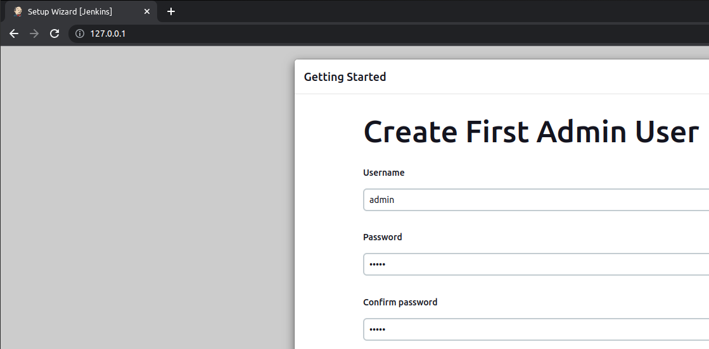

# Docker setup for jenkins with workers

### Start master Jenkins
```
cp .env.example .env
invoke start
```
### Usefull invoke commands
```
invoke registry-login
invoke build-images
invoke push-images
invoke get-password
invoke destroy
invoke create-backup
invoke --list (see all invoke shortcuts)
```

### Get credentials for first setup
```
docker exec -t <master_id> cat /var/jenkins_home/secrets/initialAdminPassword
```

### Set correct .env variables in your [Jenkins](http://127.0.0.1)


### Increase number of workers
```
docker service scale jenkins_jenkins-worker=5
```

### Remove stack
```
docker stack rm jenkins
docker swarm leave -f
```

### Upload volume to S3
```
python3 ./data.py -i <AWS_ID> -k <AWS_KEY> -r <AWS_REGION> -b <AWS _S3_BUCKET> -f data -m S3_TO_LOCAL
```

### Download volume from S3
```
python3 ./data.py -i <AWS_ID> -k <AWS_KEY> -r <AWS_REGION> -b <AWS _S3_BUCKET> -f data -m LOCAL_TO_S3
```

### TODO:
- get functions from data.py for downloading/uploading files in invoke file
- add Dockerfiles for setup different types of workers (Terraform - done)

